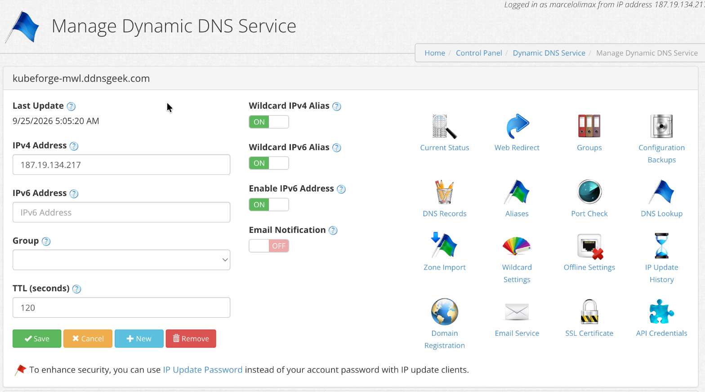
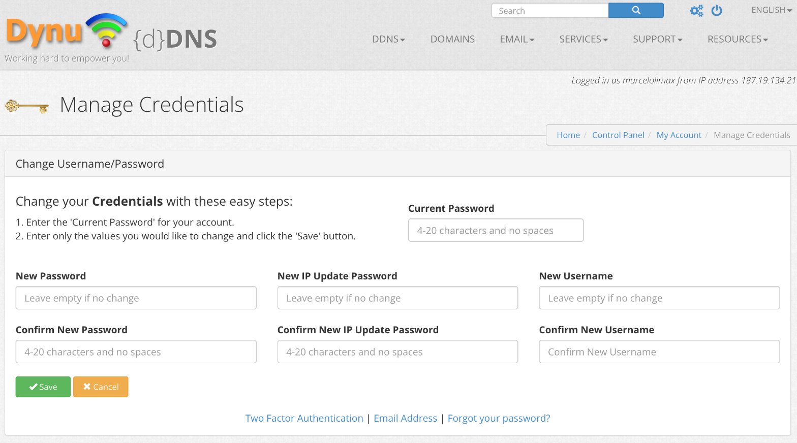
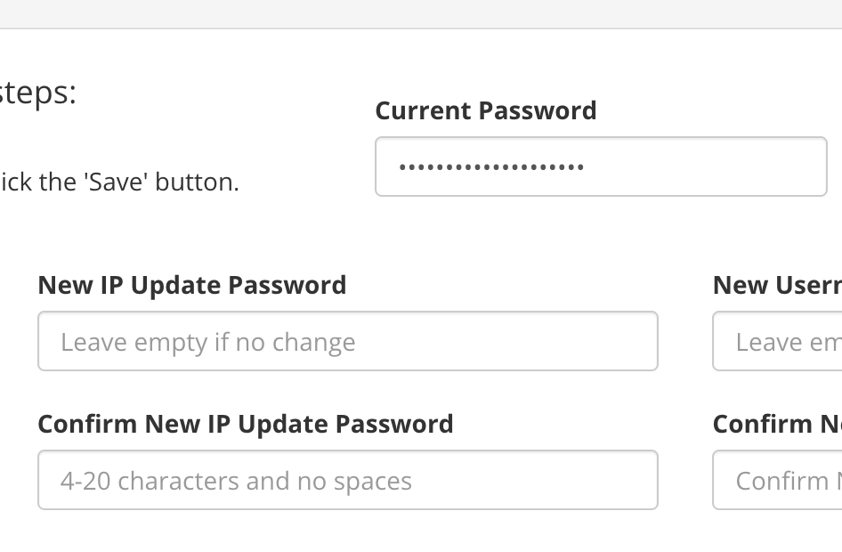

# Guia Dynu DDNS — IP estável para o cluster entre sessões

> Este guia resolve **um** problema: o IP público do server muda a cada sessão do
> AWS Academy Learner Lab, e sem um nome fixo você teria que reconfigurar o
> `kubectl` toda vez. O Dynu dá um **hostname que aponta sempre pro IP atual** do
> server, atualizado automaticamente.

## 1. A ideia em 30 segundos

```text
Toda sessão o server ganha um IP público NOVO.
   ↓
Um timer no server avisa o Dynu: "meu IP agora é X".
   ↓
kubeforge-<iniciais>.ddnsgeek.com passa a apontar pro IP novo.
   ↓
Seu kubectl usa o NOME (não o IP) → nunca mais reconfigura nada.
```

Você configura isso **uma vez**. Depois é automático em toda sessão.

## 2. Dois tipos de senha no Dynu (a causa nº 1 de confusão)

O Dynu tem **duas senhas diferentes**, e usar a errada é o erro mais comum:

| Senha | Para que serve | Usamos aqui? |
|---|---|---|
| **Senha da conta** | Logar no site, gerenciar tudo (DNS, domínios, e-mail) | ❌ NÃO |
| **IP Update Password** | SÓ atualizar o IP de um hostname | ✅ SIM |

**Por que a IP Update Password, não a da conta?** A senha vai ficar escrita no
`user_data` da EC2, que é **legível na console AWS**. Se fosse a senha da conta e
ela vazasse, alguém teria acesso total ao seu Dynu. A IP Update Password só
consegue repointar IP — e é revogável. O próprio Dynu recomenda:
> 🚩 *"To enhance security, you can use IP Update Password instead of your account
> password with IP update clients."*

## 3. Criar o hostname (uma vez)

1. Login no [Dynu](https://www.dynu.com) → **Control Panel** → **DDNS Services** (ou
   **Dynamic DNS Service**).
2. **Add** (ou **+ New**) um hostname. Convenção do projeto:
   **`kubeforge-<suas-iniciais>.ddnsgeek.com`** — ex.: `kubeforge-mwl.ddnsgeek.com`.
   - `ddnsgeek.com` é um dos domínios grátis do Dynu; escolha ele na lista.
3. Salve. O hostname existe agora (aponta pro seu IP atual — será sobrescrito pelo
   server quando o lab subir; isso é esperado).

A tela **Manage Dynamic DNS Service** do hostname fica assim (repare no IPv4 atual e no
link **IP Update Password** no rodapé):



## 4. Criar a IP Update Password (uma vez)

1. Control Panel → **My Account** → **Manage Credentials** (a tela "Change
   Username/Password"):

   

2. Preencha **exatamente 3 campos** (destaque nos campos certos):

   

   - **Current Password** → a senha **da sua conta** Dynu (a de login). Só autoriza a mudança.
   - **New IP Update Password** → invente uma senha nova (4-20 chars, **sem espaços**).
     Ex.: `kubeforge-ipupd-2026` (use a sua).
   - **Confirm New IP Update Password** → repita a mesma.
3. Deixe **New Password** e **New Username** VAZIOS (você não muda a senha da conta).
4. **Save**.

✅ A senha que você digitou em "New IP Update Password" é a que vai no Terraform.

## 5. Colocar no Terraform

No `terraform.tfvars` (que é **gitignored** — nunca vai pro git):

```hcl
owner_initials = "mwl"                    # suas iniciais → kubeforge-mwl.ddnsgeek.com
dynu_domain    = "ddnsgeek.com"           # troque se usou outro domínio
dynu_password  = "kubeforge-ipupd-2026"   # a IP Update Password que você criou
```

Só isso. O Terraform monta o hostname das iniciais, injeta no `--tls-san` do k3s
(pro cert ser válido pro nome) e instala o timer no server.

## 6. O que acontece quando você roda `terraform apply`

1. O server sobe e, no boot, o `systemd timer` (`kubeforge-dynu.timer`) dispara.
2. Ele lê o IP público do server (via IMDS) e faz **1 request** ao Dynu:
   `GET https://api.dynu.com/nic/update?hostname=...&myip=<IP>&password=<senha>`
3. O A record do hostname passa a apontar pro IP do server.
4. Repete a cada 15 min, mas SÓ chama a API do Dynu se o IP tiver mudado (cache em /var/lib/kubeforge/last-ip) — evita rate limit por updates repetidos.

## 7. Validar (após o apply)

```bash
# 1) O hostname aponta pro IP do server?
dig +short kubeforge-mwl.ddnsgeek.com
terraform output -raw server_public_ip
# os dois devem bater.

# 2) O timer está rodando no server?
ssh -i vockey.pem ubuntu@$(terraform output -raw server_public_ip) \
  'sudo systemctl status kubeforge-dynu.timer --no-pager; \
   sudo journalctl -u kubeforge-dynu -n 5 --no-pager'
# deve mostrar "resp=good <IP>" ou "resp=nochg <IP>" (ambos = sucesso no Dynu).

# 3) kubectl pelo hostname:
terraform output -raw kubeconfig_howto   # comandos prontos com o hostname
```

## 8. Respostas do Dynu (o que o `journalctl` mostra)

| Resposta | Significa |
|---|---|
| `good <IP>` | ✅ IP atualizado com sucesso |
| `nochg <IP>` | ✅ IP não mudou (já estava certo) — também é sucesso |
| `badauth` | ❌ senha errada — você usou a senha da CONTA, não a IP Update Password |
| `nohost` | ❌ hostname não existe no Dynu (crie na seção 3) |
| `notfqdn` | ❌ hostname mal formado (confira `owner_initials`/`dynu_domain`) |

## 9. Erros comuns (e a cura)

- **`badauth` no journalctl** → você pôs a senha da conta em `dynu_password`. Troque
  pela IP Update Password (seção 4).
- **`nohost`** → o hostname `kubeforge-<iniciais>.ddnsgeek.com` não existe no Dynu.
  Crie primeiro (seção 3). O timer só repointa; não cria.
- **`kubectl` diz `x509: certificate is valid for ... not kubeforge-...`** → o
  hostname não entrou no `--tls-san`. Confirme que `owner_initials` estava preenchido
  ANTES do apply (o SAN é gravado no boot do server). Se preencheu depois, recrie o
  server: `terraform apply` (ele detecta a mudança no user_data).
- **`dig` retorna um IPv6 (AAAA) antigo** → no Dynu, desligue **Enable IPv6 Address**
  no hostname (usamos só IPv4).
- **`dig` não retorna nada** → propagação; espere ~1-2 min (TTL 120s) e tente de novo.

## 10. Segurança — resumo

- Use a **IP Update Password dedicada**, nunca a senha da conta.
- Se ela vazar (o `user_data` é legível na console EC2), o pior caso é alguém
  repointar seu hostname — **revogue** trocando a IP Update Password no Dynu (seção 4).
- `terraform.tfvars` (com a senha) é **gitignored** — nunca committe.
