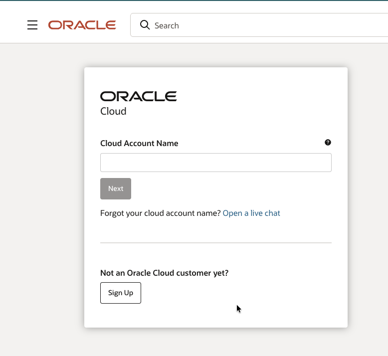
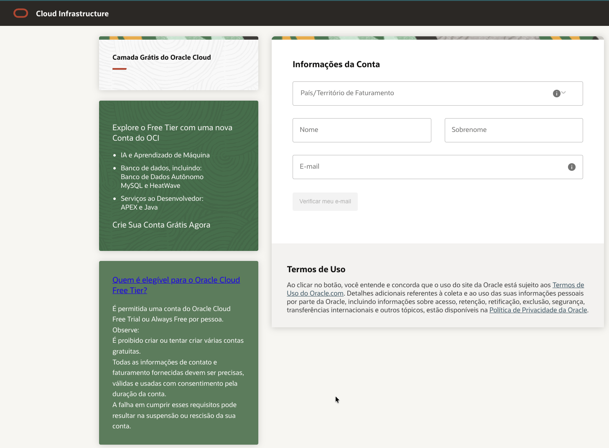
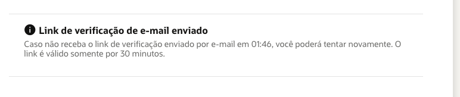
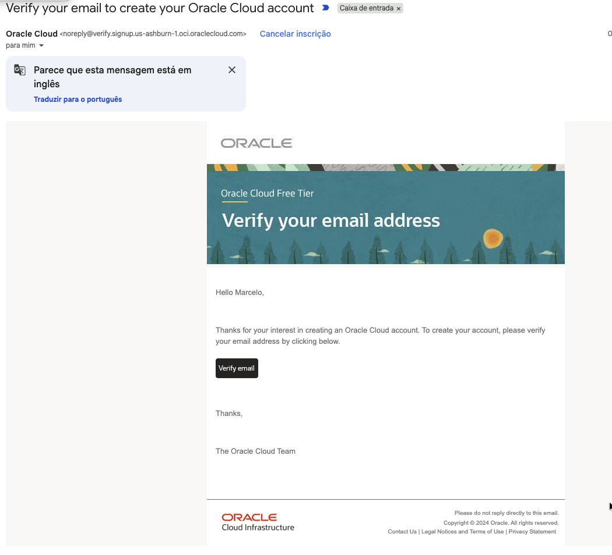
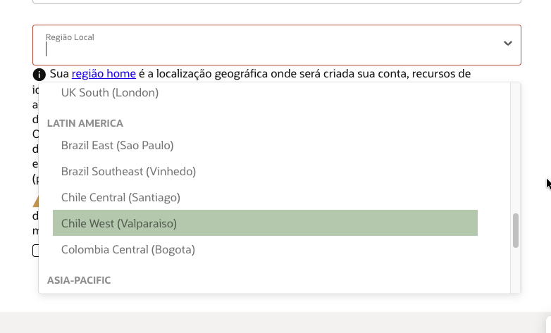
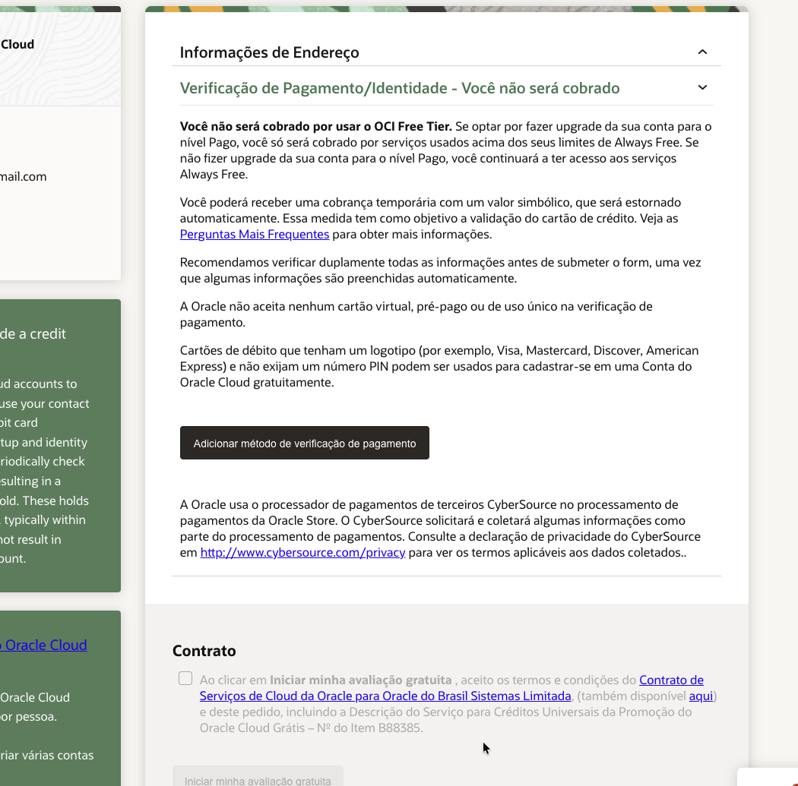
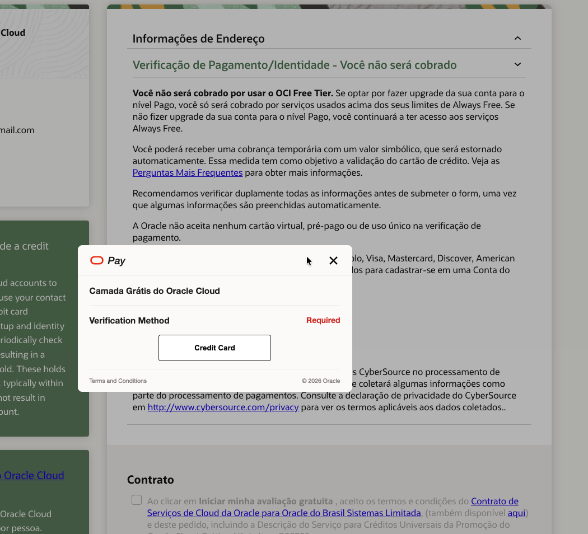
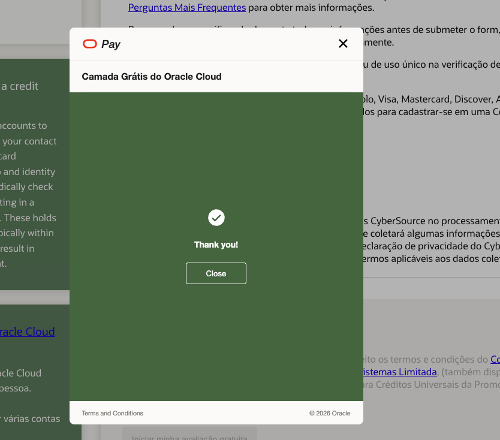
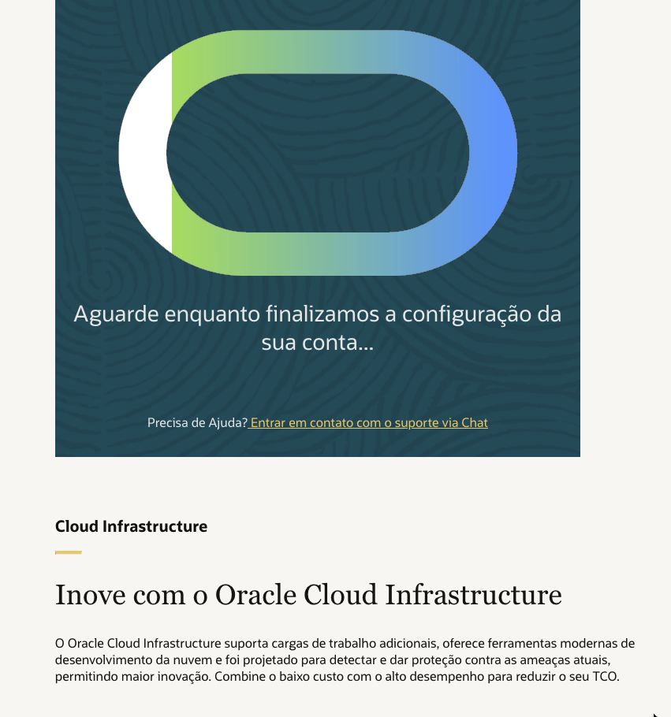
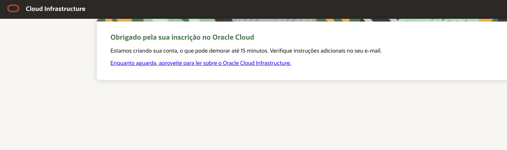

# Criação da Conta Oracle Cloud Free Tier

> Parte do **LAB 01 — OCI Foundation** do projeto [KubeForge](../../../README.md).
> Este guia cobre o pré-requisito zero da trilha: ter uma conta **Oracle Cloud Infrastructure (OCI)**
> ativa no nível **Always Free**, onde toda a plataforma KubeForge será construída sobre
> **Ampere A1 (ARM64)**.

---

## Objetivo

Criar uma conta Oracle Cloud Free Tier pessoal, com **região home = Brazil East (São Paulo)**,
apta a provisionar recursos **Always Free** (incluindo as VMs Ampere A1 ARM64 usadas nos labs
seguintes).

## Pré-requisitos

| Item | Detalhe |
|---|---|
| E-mail válido | Receberá o link de verificação (válido por 30 minutos) |
| Telefone | Para verificação por SMS/ligação |
| **Cartão de crédito ou débito real** | Apenas para verificação de identidade — **você não será cobrado** no Free Tier. A Oracle **não aceita** cartão virtual, pré-pago ou de uso único |
| Endereço válido | Deve ser preciso — dados falsos podem suspender a conta |

> ⚠️ **Uma conta por pessoa.** É proibido criar múltiplas contas gratuitas. Informações de contato
> e faturamento imprecisas podem resultar em suspensão ou rescisão da conta.

---

## Passo a passo

### 1. Acessar a página do Free Tier e iniciar o cadastro

Acesse **<https://www.oracle.com/cloud/free/>** e clique em **Sign up now**.

### 2. Selecionar "Not an Oracle Cloud customer yet?"

Na tela de login, ignore o campo *Cloud Account Name* (destinado a quem já tem conta) e clique em
**Sign Up**, logo abaixo de **Not an Oracle Cloud customer yet?**.

### 3. Preencher as informações da conta

Preencha o formulário **Informações da Conta**:

- **País/Território de Faturamento**: Brasil
- **Nome** e **Sobrenome**
- **E-mail** (será verificado no próximo passo)

Clique em **Verificar meu e-mail**.

### 4. Aguardar o link de verificação de e-mail

A Oracle confirma o envio do link. O link é **válido por 30 minutos**; se não chegar dentro do
tempo indicado, é possível reenviar.

### 5. Verificar o e-mail

Abra a caixa de entrada, localize o e-mail **"Verify your email to create your Oracle Cloud account"**
(remetente `noreply@verify.signup...oraclecloud.com`) e clique em **Verify email**.

### 6. Escolher tipo de conta e região home

Após verificar o e-mail, complete o cadastro:

- **Tipo de conta**: **Pessoal** (Individual)
- **Região Local / Home Region**: **Brazil East (Sao Paulo)**

> 🔒 **A região home é imutável.** Ela define onde a conta e os recursos Always Free são criados
> e **não pode ser alterada depois**. Para este projeto, selecione **Brazil East (Sao Paulo)**.
>
> A imagem abaixo ilustra o seletor de regiões da América Latina — repare que ali há **Brazil East
> (Sao Paulo)** e **Brazil Southeast (Vinhedo)**. Escolha **Brazil East (Sao Paulo)** (no print, o
> item destacado é apenas o efeito de hover do mouse, não a seleção final).

### 7. Cadastrar o cartão para verificação de identidade

Na seção **Verificação de Pagamento/Identidade — Você não será cobrado**, clique em
**Adicionar método de verificação de pagamento**.

Um pop-up **Oracle Pay** abre solicitando o método de verificação. Clique em **Credit Card** e
informe os dados do cartão **real**.

> 💳 **Sobre a cobrança:** você **não será cobrado** por usar o OCI Free Tier. Pode ocorrer uma
> **cobrança temporária de valor simbólico**, estornada automaticamente, apenas para validar o cartão.
> Cartões de débito com bandeira (Visa, Mastercard, etc.) e sem PIN também são aceitos.

Ao concluir, o pop-up confirma com **Thank you!**. Clique em **Close**.

> 🚨 **ALERTA IMPORTANTE — bloqueie o cartão logo após a validação.**
> A Oracle valida o cartão com uma cobrança simbólica (estornada). **Assim que a
> conta for criada e o cartão validado**, o recomendado é **bloquear/desativar
> esse cartão no app do seu banco** (ou usar um cartão descartável só para este
> cadastro). Motivo: se você **esquecer um recurso ligado** que saia do
> Always Free (um segundo Load Balancer, banda de LB acima de 10 Mbps, storage
> além da cota, upgrade acidental para Pay As You Go), a Oracle **cobra no cartão
> cadastrado** — e você só descobre na fatura. Bloquear o cartão é a rede de
> segurança contra cobrança esquecida. Para voltar a criar recursos pagos de
> propósito, é só reativar o cartão na hora.
>
> A cobrança de validação já terá sido feita e estornada antes do bloqueio —
> bloquear **depois** da validação não atrapalha a criação da conta.

### 8. Aceitar o contrato e criar a conta

De volta ao formulário, marque a caixa do **Contrato** (Contrato de Serviços de Cloud da Oracle) e
clique em **Iniciar minha avaliação gratuita**.

A Oracle inicia a criação da conta:

### 9. Aguardar a confirmação por e-mail

A tela final confirma a inscrição. A criação da conta **pode levar até 15 minutos**; instruções
adicionais chegam por e-mail.

---

## Resultado esperado

- [x] Conta Oracle Cloud Free Tier **pessoal** criada
- [x] Região home = **Brazil East (Sao Paulo)**
- [x] Cartão validado (sem cobrança efetiva)
- [x] E-mail de boas-vindas recebido com o link de acesso ao Console

Ao final, você deve conseguir acessar o **OCI Console** e ver o tenancy provisionado — ponto de
partida para o restante do **LAB 01 (OCI Foundation)**: Compartments, IAM, VCN, Subnets, Gateways e
o primeiro contato com o **Terraform OCI Provider**.

---

## Cost Considerations

| Recurso | Impacto no Free Tier | Observação |
|---|---|---|
| Criação da conta | **Zero** | Nível Always Free |
| Verificação do cartão | Cobrança simbólica temporária | **Estornada automaticamente** |
| Upgrade para Pago | Só cobra acima dos limites Always Free | Opcional — não necessário para os labs |

Nenhum recurso pago é criado nesta etapa.

## Troubleshooting

| Sintoma | Causa provável | Ação |
|---|---|---|
| Link de verificação não chega | Atraso / spam | Verificar spam; reenviar (link expira em 30 min) |
| Cartão recusado | Cartão virtual/pré-pago/uso único | Usar cartão de crédito ou débito **real** com bandeira, sem PIN |
| "Você já tem uma conta" | Limite de 1 conta por pessoa | Recuperar a conta existente em vez de criar outra |
| Criação travada | Processamento normal | Aguardar até 15 min; conferir e-mail |
| Escolheu a região errada | Região home é imutável | Não há como alterar — atenção redobrada no passo 6 |

## ARM64 Compatibility

**ARM64 Compatible: N/A** — esta etapa é de provisionamento de conta. A relevância para ARM64 aparece
no LAB 02 (OKE + Ampere A1), quando os node pools ARM64 forem criados na região home definida aqui.
